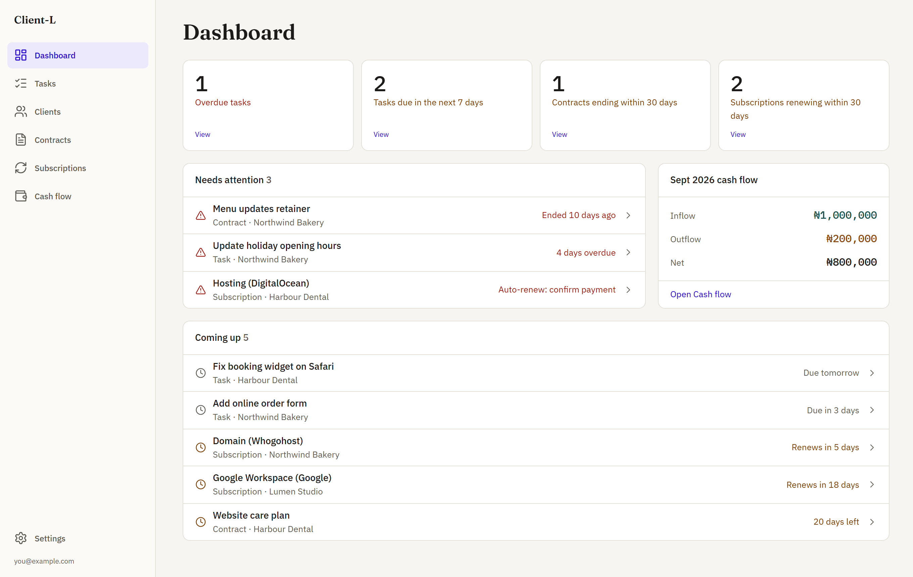
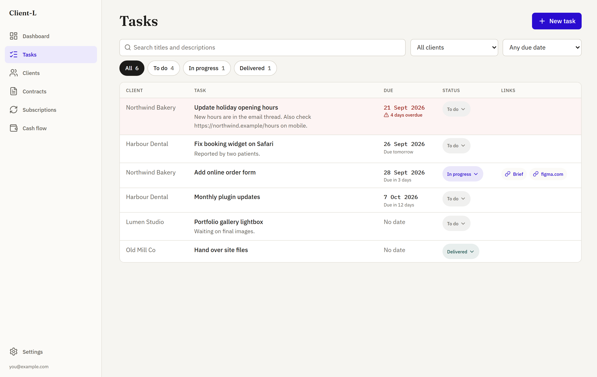
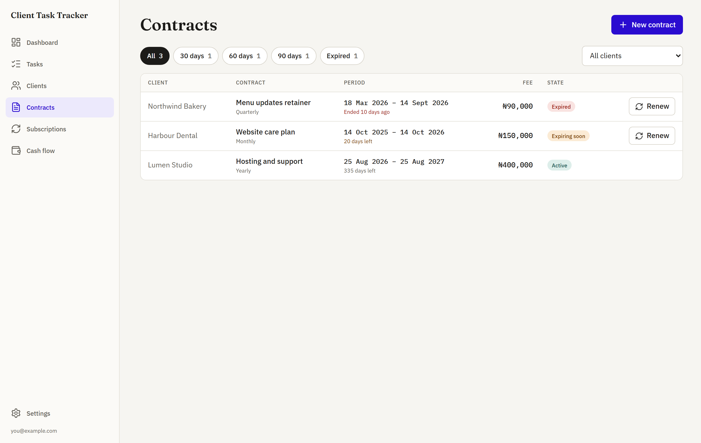
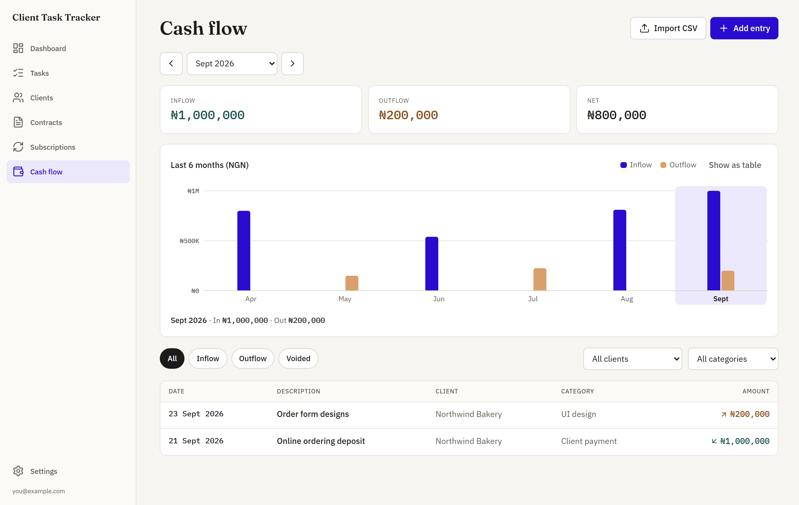
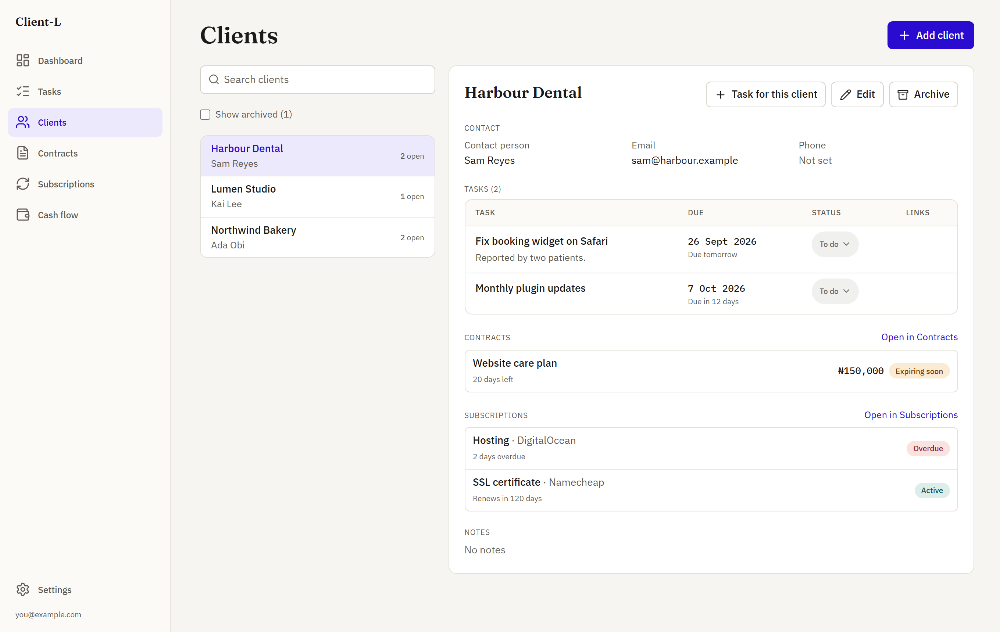
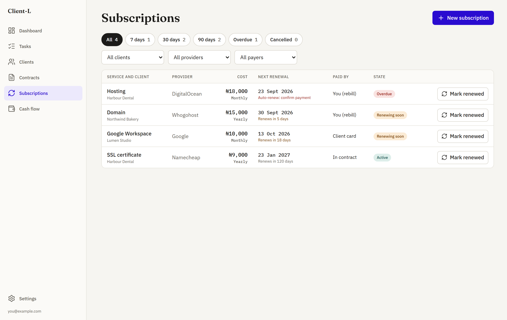
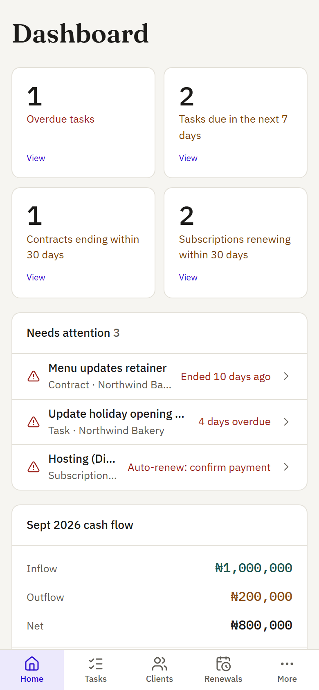

# Client-L

A private web app for freelancers and consultants: every client, task, maintenance contract,
subscription you manage for them, and payment in or out, in one place. Everything is stored in
your own Google Sheet and runs under your own Google account, so there is no server to host and
nothing to pay for.

**[Get your own copy](https://docs.google.com/spreadsheets/d/1PqqwYovN_38K8a_iryFHadgJ4RVLnFCOeXozG2-yq7g/copy)**:
free, about 10 minutes, no code. Then follow [the install steps](#install-in-about-10-minutes-no-code).



## What it does

- **Dashboard**: overdue tasks, tasks due this week, contracts ending and subscriptions renewing
  soon, and this month's money in and out. Every number opens the matching list.
- **Tasks**: each task belongs to a client and has a title, description, links and an optional
  due date. Change status in one click; overdue tasks are flagged in red and in words.
- **Your own statuses**: start with To do, In progress and Delivered, then add your own (for
  example "Waiting on client"), pick colours, reorder or retire them.
- **Clients**: contact details, notes, and every task, contract and subscription for that client.
  Archive clients you no longer work with; their history stays.
- **Contracts**: retainers and maintenance agreements. See what ends in the next 30, 60 or 90 days
  and renew in one step; the old contract stays in the history.
- **Subscriptions**: domains, hosting, email and licences you manage for clients, with renewal
  dates, who pays, and a reminder to charge the client when you rebill.
- **Cash flow**: money in and out with monthly totals per currency and a 6-month chart. Import an
  existing sheet from a CSV file and see exactly what will be added before anything is saved.
- **Private by default**: only the Google accounts you allow can open the app. Works on phones.

| Tasks                                | Contracts                                    | Cash flow                                    |
| ------------------------------------ | -------------------------------------------- | -------------------------------------------- |
|  |  |  |

| Clients                                  | Subscriptions                                        | On a phone                                     |
| ---------------------------------------- | ---------------------------------------------------- | ---------------------------------------------- |
|  |  |  |

## Privacy

Each copy runs under its owner's Google account and stores data only in that owner's sheet.
**Nothing is sent to the authors of this project or to any third party.** The app never asks for,
stores or shows passwords; use the notes fields to point to your password manager.

When you first run it, Google asks you to allow three things:

| Permission                               | Why                                                          |
| ---------------------------------------- | ------------------------------------------------------------ |
| See and edit the spreadsheet it runs in  | Your data lives in this one sheet and nowhere else.          |
| See your email address                   | To check the person opening the app is on your allowed list. |
| Show menus and alerts in the spreadsheet | For the Client-L menu (set up, sample data).                 |

## Install in about 10 minutes (no code)

1. **[Make a copy of the Client-L template](https://docs.google.com/spreadsheets/d/1PqqwYovN_38K8a_iryFHadgJ4RVLnFCOeXozG2-yq7g/copy)**
   and choose **Make a copy**. The copy is yours, in your own Google Drive; the template holds no
   data.
2. In your copy, wait a few seconds for the **Client-L** menu to appear, then choose
   **Client-L > Set up this sheet**. Approve the permissions (see the table above).
   Google may warn that the app is unverified, because it is your own private copy: choose
   **Advanced > Go to Client-L**. Setup creates the tabs and adds your email to the
   allowed list.
3. Optional: **Client-L > Add sample data** to see how everything works. Remove it any
   time with **Clear sample data**; your own records are never touched.
4. Choose **Extensions > Apps Script**, then **Deploy > New deployment**. Pick the type **Web
   app**, set **Execute as** to _Me_ and **Who has access** to _Anyone with a Google account_,
   then **Deploy**. Open the web app URL and bookmark it.

> **"Sorry, unable to open the file at present"?** This is a Google bug that affects Apps Script
> web apps when the browser is signed in to more than one Google account. Open the app in a
> browser profile signed in only with the account that deployed it (or in a private window).

## Install from the code (for developers)

You need Node.js 22 or later and a Google account.

```sh
git clone https://github.com/Jaachimike/Client-L.git
cd Client-L
npm ci
npx clasp login
npx clasp create --type sheets --title "Client-L" --rootDir dist
npm run push
```

`clasp create` writes `.clasp.json`, which Git ignores. To use an existing sheet instead, copy
`.clasp.example.json` to `.clasp.json` and set `scriptId`. Then open the sheet, run **Client Task
Tracker > Set up this sheet** and deploy as in step 4 above.

## Updating

Updating only replaces the app's code. Your clients, tasks and money records stay in the sheet and
are never changed. Your copy never updates by itself: you choose when, and you can read the new
code on GitHub first. Nothing about your data is sent anywhere when you update.

To see which version you have, open **Settings** in the app and look under **About**.

### Updating without code

1. Open the [latest release](https://github.com/Jaachimike/Client-L/releases/latest) and download
   the three files under **Assets**: `Code.js`, `index.html` and `appsscript.json`. The release
   notes say what changed.
2. In your Client-L sheet, choose **Extensions > Apps Script**.
3. The first time only: click **Project settings** (the gear icon) and tick **Show
   "appsscript.json" manifest file in editor**. Then click **Editor** (the `< >` icon) to go back.
4. For each file, open the matching file in the editor, select everything in it (Ctrl+A, or Cmd+A
   on a Mac), delete it, paste in the whole downloaded file, and click **Save** (the disk icon):

   | Downloaded file   | File in the editor |
   | ----------------- | ------------------ |
   | `Code.js`         | `Code.gs`          |
   | `index.html`      | `index.html`       |
   | `appsscript.json` | `appsscript.json`  |

   Open the downloaded files in a plain text editor (Notepad, TextEdit or VS Code), not a word
   processor, so nothing changes when you copy them.

5. Choose **Deploy > Manage deployments**, click the pencil, set **Version** to _New version_ and
   click **Deploy**. Your web app address stays the same.
6. Reload the spreadsheet and run **Client-L > Set up this sheet**. It adds any new tabs or settings
   and leaves everything else alone. If Google asks for permissions again, the release notes explain
   what is new.
7. Open the app and check that **Settings > About** shows the new version. If it warns that the page
   and the server code are from different versions, one file was missed: paste it and deploy again.

### Updating from the code

Developers can run `git pull`, `npm ci` and `npm run push` with `.clasp.json` pointing at the
sheet's script (its ID is under **Extensions > Apps Script > Project settings**), then follow steps
5 to 7 above.

## Letting other people in

Add their email under **Settings > Access** (or in the `Allowed emails` row of the Settings tab).
It takes effect on their next page load; no redeploy is needed. Google does not always share the
email of personal Gmail accounts with an app run by someone else, so people outside your own
Google Workspace domain may still be denied.

## Currencies

Client-L works with several currencies side by side. Under **Settings > Warnings and defaults**:

- **Tick the currencies you use** from the list of common ones (naira, US dollar, euro, pound,
  cedi, shilling, rand, CFA franc and more). Only ticked currencies appear in the contract,
  subscription and cash flow forms. A new copy starts with USD, EUR and GBP ticked.
- **Add any other currency** that is not in the list by typing its 3-letter ISO code (for example
  `SEK` or `BRL`) under **Add another currency**. You can add as many as you need.
- **Pick your default currency**, which new entries start with and which the dashboard totals use.

Totals are always kept separate per currency and never added together; the Cash flow screen has a
currency switch. Unticking a currency hides it from new entries but keeps it on existing ones.
You can also edit the `Currencies` row in the Settings tab directly, as codes separated by commas.

## Importing an existing sheet

In your old sheet choose **File > Download > Comma-separated values (.csv)**. In the app open
**Cash flow > Import CSV** and choose the file. The first row must hold column headers. The app
recognises Description, Inflow, Outflow (or Amount and Type), Project Name or Client, Date (day
first, such as 03/03/2025), Currency, Category and Comments. You will see how many entries will be
added, which rows are skipped and why (blank rows and TOTAL rows are always skipped), and which
clients will be created. Importing the same file twice does not add anything twice.

## Using the sheet directly

You can read and edit the sheet yourself; the app picks up changes on the next load. Columns are
matched by their header, so you can reorder them or add your own. Records link to each other by
ID, so renaming a client never breaks its tasks. Contract and subscription states are worked out
from the dates, so they are never out of date.

## Using your own web address

Google serves the app from a `script.google.com` address, and it cannot be moved to your own
domain. To give it a friendlier address, make a subdomain such as `tasks.example.com` redirect to
your web app URL. Most domain providers call this **URL forwarding** or a **redirect rule**; choose
a permanent (301) redirect to the full URL ending in `/exec`, and turn off forwarding the path
(an extra path on the end would break the link). Visitors still sign in with Google as usual, and
the address bar shows the Google address once the app opens. Embedding the app in a frame on your
own site is not supported, because Google's sign-in page will not load inside a frame.

## Troubleshooting

| You see                          | What to do                                                              |
| -------------------------------- | ----------------------------------------------------------------------- |
| "Setup needed"                   | Run **Client-L > Set up this sheet** in the spreadsheet.                |
| "Access denied" for yourself     | Check your email is in the `Allowed emails` row of the Settings tab.    |
| "Sorry, unable to open the file" | Use a browser profile signed in to only one Google account (see above). |
| The menu does not appear         | Reload the spreadsheet and wait a few seconds.                          |

## Development

| Task                                             | Command                                                     |
| ------------------------------------------------ | ----------------------------------------------------------- |
| Run locally with sample data (no Google account) | `npm run dev`                                               |
| Tests                                            | `npm test`                                                  |
| Lint, format check, type check                   | `npm run lint`, `npm run format:check`, `npm run typecheck` |
| Build `dist/`                                    | `npm run build`                                             |
| Everything CI runs                               | `npm run check`                                             |

The front end is React and TypeScript, bundled by Vite into one HTML file. The back end is
Google Apps Script written in TypeScript. `npm run dev` runs the real server code against an
in-memory sheet, so you can work on the UI without deploying. See
[CONTRIBUTING.md](CONTRIBUTING.md) before opening a pull request.

## License

[MIT](LICENSE) © 2026 Jaachi Okafor
